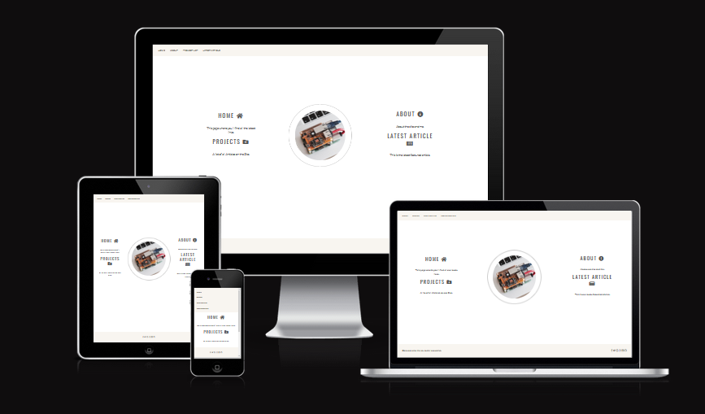

# My Projects Website

Primarily this site is developed with the intention of documenting project that I'm interested in and have completed. It provides an account of what I did to complete the projects and to document any issues experinced along the way. So often, I complete a project but then later forget how I achieved the result so do it again. Inevitably, each project has it's own unique obstacles to overcome and almost always requires some tweeking to make it work.

On a broader level I'm hoping that it will provide a useful resourse to others who are interested in completing the similar projects of their own.

Initially, my first artcle was to be a tutorial on setting up a security camera using Docker on a headless Debian 11 server. However, I decided that a far more relevant, timely and useful tutorial would be create VSCode local development environment that specifically used the Code Instute recommended template. This would answer the question that many students posted in the CI Slack channel: "How do I setup a local VSCode dev environment?"



## User Experience (UX)

- ### User stories

  - #### First Time Visitor Goals

    1. As a First Time Visitor, I want to see projects that interest me.
    2. As a First Time Visitor, I want to be able to easily navigate throughout the site to find content.
    3. As a First Time Visitor, I to find relevant links on social media to determine how trusted and known the authors are.

  - #### Returning Visitor Goals

    1. As a Returning Visitor, I want to find additional artcles.
    2. As a Returning Visitor, I want to find ideas for my own projects.

  - #### Frequent User Goals
    1. As a Frequent Visitor, I expect to find a rich variety of new and interesting projects.

- ### Design
  - #### Colour Scheme
    - The colours used are based on a pallette sourced from https://coolors.co/054a91-3e7cb1-81a4cd-dbe4ee . This is a blended blue and white theme.
  - #### Typography
    - The Montserrat and Roboto font are the main fonts used throughout the whole website with Sans Serif as the fallback font. This was decided follow reading an article at https://typ.io/s/e4pl.
  - #### Imagery
    - The main Raspberry Pi and Mac image was sourced from https://unsplash.com/@_louisreed. All other screen shot images for the latest.html article were created by me.

* ### Wireframes

  - Home page and about Wireframe - [View](media/wireframe.jpg)

  - Mobile Wireframe - [View](media/wireframe_mob.jpg)

  - latest and projects Page Wireframe - [View](media/wireframe2.jpg)

## Features

- Responsive on all device sizes

- Interactive elements

## Technologies Used

### Languages Used

- [HTML5](https://en.wikipedia.org/wiki/HTML5)
- [CSS3](https://en.wikipedia.org/wiki/Cascading_Style_Sheets)

### Frameworks, Libraries & Programs Used

1. [Bootstrap 4.4.1:](https://getbootstrap.com/docs/4.4/getting-started/introduction/)
   - Bootstrap was used to assist with the responsiveness and styling of the website.
1. [Google Fonts:](https://fonts.google.com/)
   - Google fonts were used to import the 'Titillium Web' font into the style.css file which is used on all pages throughout the project.
1. [Font Awesome:](https://fontawesome.com/)
   - Font Awesome was used on all pages throughout the website to add icons for aesthetic and UX purposes.
1. [jQuery:](https://jquery.com/)
   - jQuery came with Bootstrap to make the navbar responsive but was also used for the smooth scroll function in JavaScript.
1. [Git](https://git-scm.com/)
   - Git was used for version control by utilizing the Gitpod terminal to commit to Git and Push to GitHub.
1. [GitHub:](https://github.com/)
   - GitHub is used to store the projects code after being pushed from Git.

## Testing

The W3C Markup Validator and W3C CSS Validator Services were used to validate every page of the project to ensure there were no syntax errors in the project.

- [W3C Markup Validator](https://jigsaw.w3.org/css-validator/#validate_by_uri) - [1 error found in boostrap js]
- [W3C CSS Validator](https://jigsaw.w3.org/css-validator/#validate_by_uri) - [1 error found in bootstrap js ]

- The Website was tested on Google Chrome, Internet Explorer, Microsoft Edge and Safari browsers.
- The website was viewed on a variety of devices such as Desktop, Laptop, iPad & Android phone.
- Testing was done to ensure that all pages were linking correctly.
- Friends and family members were asked to review the site and documentation to point out any bugs and/or user experience issues.

### Known Bugs

- The about page is missing content

## Deployment

### GitHub Pages

The project was deployed to GitHub Pages using the following steps...

1. Log in to GitHub and locate the [GitHub Repository](https://github.com/neil9669/MyHobbyProjects)
2. At the top of the Repository (not top of page), locate the "Settings" Button on the menu.
3. Scroll down the Settings page until you locate the "GitHub Pages" Section.
4. Under "Source", click the dropdown called "None" and select "Master Branch".
5. The page will automatically refresh.
6. Scroll back down through the page to locate the now published site [link](https://github.com) in the "GitHub Pages" section.

### Forking the GitHub Repository

By forking the GitHub Repository we make a copy of the original repository on our GitHub account to view and/or make changes without affecting the original repository by using the following steps...

1. Log in to GitHub and locate the [GitHub Repository](https://github.com/neil9669/MyHobbyProjects)
2. At the top of the Repository (not top of page) just above the "Settings" Button on the menu, locate the "Fork" Button.
3. You should now have a copy of the original repository in your GitHub account.

### Making a Local Clone

1. Log in to GitHub and locate the [GitHub Repository](https://github.com/neil9669/MyHobbyProjects)
2. Under the repository name, click "Clone or download".
3. To clone the repository using HTTPS, under "Clone with HTTPS", copy the link.
4. Open Git Bash
5. Change the current working directory to the location where you want the cloned directory to be made.
6. Type `git clone`, and then paste the URL you copied in Step 3.

```
$ git clone https://github.com/YOUR-USERNAME/YOUR-REPOSITORY
```

7. Press Enter. Your local clone will be created.

```
$ git clone https://github.com/YOUR-USERNAME/YOUR-REPOSITORY
> Cloning into `CI-Clone`...
> remote: Counting objects: 10, done.
> remote: Compressing objects: 100% (8/8), done.
> remove: Total 10 (delta 1), reused 10 (delta 1)
> Unpacking objects: 100% (10/10), done.
```

Click [Here](https://help.github.com/en/github/creating-cloning-and-archiving-repositories/cloning-a-repository#cloning-a-repository-to-github-desktop) to retrieve pictures for some of the buttons and more detailed explanations of the above process.

## Credits

### Code

- [Bootstrap4](https://getbootstrap.com/docs/4.4/getting-started/introduction/): Bootstrap Library used throughout the project mainly to make site responsive using the Bootstrap Grid System.

### Content

- All content was written by the developer.

- Additional articles were sourced from https://www.zdnet.com attributing the original authors. I messaged the website for permission to use the content.

### Media

- All Images were created by the developer except the homepage image.

### Acknowledgements

- My Mentor for continuous helpful feedback.

- Tutor support at Code Institute for their support.
